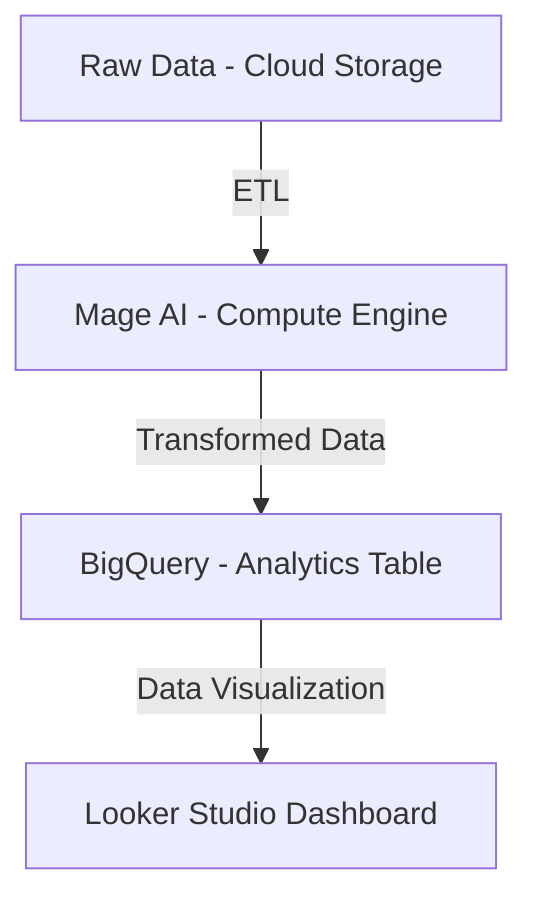

# 🚖 Uber Data Analytics | End-to-End Data Engineering Project

## 📝 Overview  
This project builds a **scalable ETL pipeline** for Uber ride data using **Google Cloud Platform (GCP)**, **Mage AI**, **BigQuery**, and **Looker Studio**. The goal is to **extract, transform, and analyze** Uber trip data to uncover **key business insights** related to **trip trends, revenue distribution, and customer behavior**.  

## Architecture 

## 🛠 Technologies Used  
- **Google Cloud Storage** – Stores raw trip data  
- **Mage AI** – ETL pipeline for data transformation  
- **BigQuery** – Cloud-based data warehouse for analytics  
- **Looker Studio** – Interactive business intelligence dashboard  
- **Python & SQL** – Used for ETL and analytical transformations  

## Dataset Used
TLC Trip Record Data
Yellow and green taxi trip records include fields capturing pick-up and drop-off dates/times, pick-up and drop-off locations, trip distances, itemized fares, rate types, payment types, and driver-reported passenger counts. 

More info about dataset can be found here:

🔗 **Dataset Source:** [NYC TLC Trip Record Data](https://www.nyc.gov/site/tlc/about/tlc-trip-record-data.page)  
📖 **Data Dictionary:** [NYC TLC Data Dictionary](https://www.nyc.gov/assets/tlc/downloads/pdf/data_dictionary_trip_records_yellow.pdf)  

## Data Model

## 🔍 Key Insights from Looker Studio Dashboard

### **1️⃣ Peak Ride Hours & Demand Trends**
- **High Demand Periods:** The highest number of trips occur during **late-night (12 AM - 2 AM) and evening (4 PM - 8 PM)**, likely due to nightlife and commuting hours.
- **Lower Demand Periods:** The early morning hours **(5 AM - 7 AM)** see significantly fewer trips, aligning with natural off-peak ride demand.

### **2️⃣ Revenue Distribution & Growth Trends**
- **Revenue Correlation with Trips:** Revenue follows a **similar pattern to trip count**, peaking in the **evenings and late nights**.
- **Daily Revenue Variability:** The dashboard reveals **fluctuations in daily earnings**, suggesting external factors like **weather, events, or seasonal trends** may impact ride volume.

### **3️⃣ Trip Fare & Payment Behavior**
- **Most Trips Priced Between $10 - $25:** The **fare distribution histogram** shows that a majority of trips fall within this price range, making it the **core revenue segment** for Uber.
- **Payment Preferences:** **Credit cards dominate** as the primary mode of payment, whereas **cash transactions remain minimal**.

### **4️⃣ Tipping Trends & Customer Behavior**
- **Only 24.6% of riders tip their drivers**, indicating that **tipping is not a universal practice** among users.
- **Credit Card Users Tip More:** **Customers paying via credit cards tip nearly 2x more** than cash users, showing a strong correlation between **digital payments and tipping behavior**.

 🌐 **You can view the live dashboard here:** [Uber Data Analytics Dashboard](https://lookerstudio.google.com/s/js6S22JOeN4)

## 🎯 Business Implications & Optimization Strategies
✅ **Surge Pricing Optimization:** Adjust pricing **dynamically during peak hours (12 AM - 2 AM, 4 PM - 8 PM)** to **maximize revenue**. 
✅ **Rider Incentives:** Encourage tipping through **in-app nudges or rewards** for **frequent tippers**, especially targeting **credit card users**. 
✅ **Cashless Payment Push:** With a **clear preference for digital transactions**, Uber could incentivize **card payments by offering discounts** on non-cash transactions. 
✅ **Targeted Promotions for Low-Demand Hours:** **Discounts during morning hours (5 AM - 7 AM)** can help **boost ridership during off-peak periods**.

🚀 **Leveraging Data to Drive Smarter Business Decisions!**
